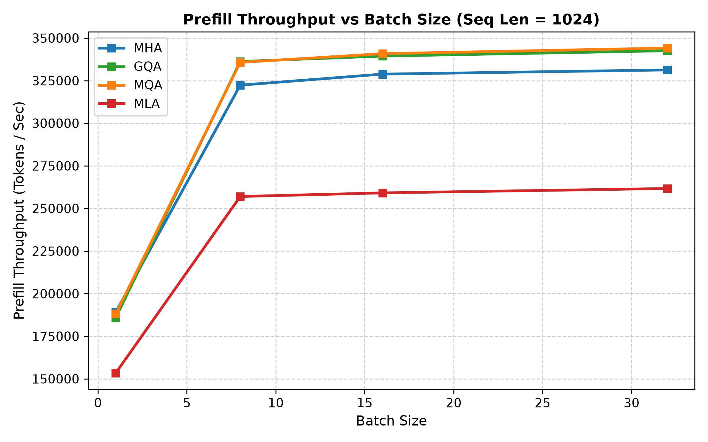
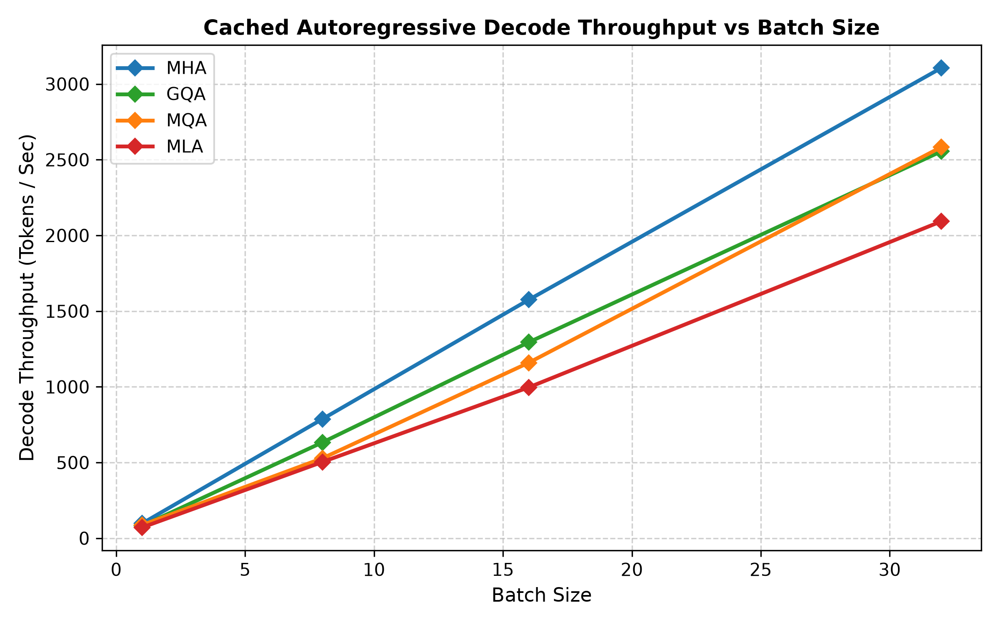

# Attention and KV-Cache Benchmarking

A PyTorch, nanoGPT-style decoder for comparing Multi-Head Attention (MHA), Multi-Query Attention (MQA), Grouped-Query Attention (GQA), and Multi-Head Latent Attention (MLA). The project implements the attention variants and cached decoding, then measures cache size, prefill throughput, decode latency, and validation perplexity.

## What I built

- Four interchangeable attention modules in [`model.py`](model.py).
- MLA with decoupled rotary position keys and a compressed latent KV representation.
- Prompt prefill and token-by-token cached decoding.
- A benchmark runner for prefill, cached decode, cache footprint, and incremental forward memory in [`benchmark.py`](benchmark.py).
- A numerical check comparing full-sequence output with token-by-token cached output in [`tests/test_correctness.py`](tests/test_correctness.py).

## Results

The benchmark numbers below are from an NVIDIA A100 40 GB, PyTorch 2.14.0+cu130, CUDA 13.0, bfloat16, seed 42, with `torch.compile` enabled. The GQA implementation used the manual attention path. These figures compare the current implementations and are not a comparison of optimized production kernels.

### KV-cache footprint

Measured tensor sizes after a prompt prefill at batch size 32 and sequence length 2048:

| Attention | Cache size | Reduction vs MHA |
| --- | ---: | ---: |
| MHA | 2,304 MB | — |
| GQA | 576 MB | 75.0% |
| MLA | 240 MB | 89.6% |
| MQA | 192 MB | 91.7% |

The measured tensor sizes match the analytical cache-size formulas. MLA stores a 128-dimensional latent and a 32-dimensional positional key per token per layer. Its cache is 58.3% smaller than GQA's in this configuration.

### Throughput and decode latency

| Attention | Prefill, B=32 / T=2048 | Decode, B=1 | Decode, B=32 |
| --- | ---: | ---: | ---: |
| MHA | 214k tokens/s | 10.14 ms/token | 10.29 ms/token |
| GQA | 229k tokens/s | 12.26 ms/token | 12.51 ms/token |
| MLA | 150k tokens/s | 14.10 ms/token | 15.28 ms/token |
| MQA | 230k tokens/s | 11.41 ms/token | 12.33 ms/token |

Prefill throughput is calculated from median latency across 10 measured runs. Decode latency is averaged across steps 2–50 after a 512-token prompt; step 1 is excluded to reduce one-time startup effects. The model dynamically extends cache tensors with concatenation at each step. This adds copying work and is a limitation of the current decode benchmark.

In this implementation, MLA's smaller cache does not make it faster: it is slower than GQA in both measured workloads. The prefill path up-projects latent keys and values and computes separate content and positional attention scores. During decode, MLA attends over the compressed representation but still performs additional projection and score work. A fixed-capacity cache and specialized fused attention kernels would be needed to assess performance closer to optimized serving systems.





### Small-data perplexity check

Each variant was trained for 150 steps with the same 4-layer, 4-head, 128-dimensional setup on the bundled TinyShakespeare text. Evaluation used a 90/10 token split. This is a single-seed sanity check, not a broad quality comparison.

| Attention | Validation loss | Perplexity | Change vs MHA |
| --- | ---: | ---: | ---: |
| MHA | 6.3482 | 571.44 | baseline |
| GQA | 6.3454 | 569.88 | -0.27% |
| MQA | 6.3562 | 576.07 | +0.81% |
| MLA | 6.3178 | 554.33 | -2.99% |

These results show what happened in this run; multiple seeds and larger evaluation data are needed before attributing the differences to the attention variants.

## Implementation notes

In MLA, the content key is reconstructed from a compressed latent, while positional information is kept in a separate RoPE-rotated key. Separating content and position lets cached decoding score against the latent directly, avoiding storage of full per-head keys and values. The implementation is educational and functional, but does not include a preallocated KV cache or a custom fused MLA kernel.

The attention variants have different parameter counts, so results reflect both architectural and implementation differences. The benchmark also reports incremental forward-pass memory separately from cache tensor size; incremental memory is not total GPU memory usage.

## Run it

Install the core dependencies:

```bash
pip install -r requirements.txt
```

Run the correctness checks:

```bash
python tests/test_correctness.py
```

Run a local benchmark on the available device:

```bash
python benchmark.py --attention mha mqa gqa mla --seq-len 256 512 1024 2048 --batch-size 1 8 16 32 --output-dir outputs
```

Run the benchmark on Modal with an A100:

```bash
modal run modal_benchmark.py
```

Install the Modal CLI separately with `pip install modal` and authenticate with `modal setup` before running it.

Run the small-data training and perplexity comparison:

```bash
python eval_perplexity.py
```

Benchmark CSVs, metadata, and plots are written under [`outputs/`](outputs/).
